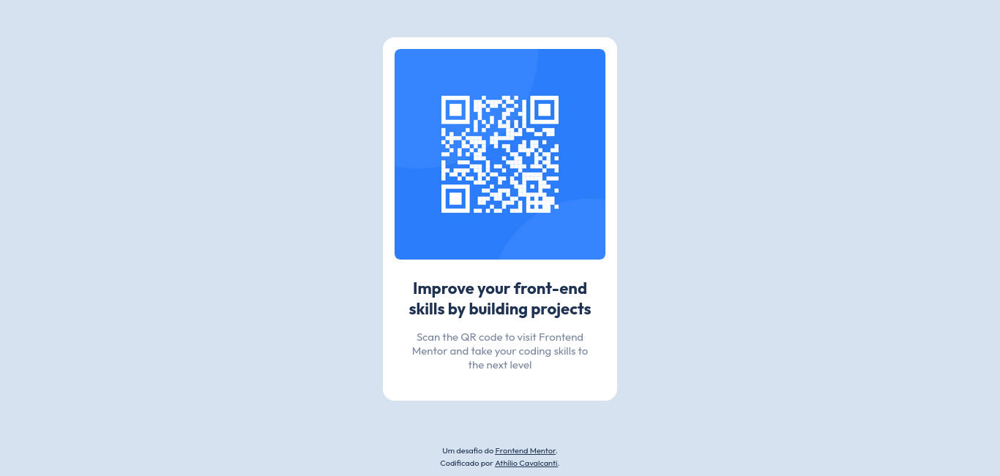

# Frontend Mentor - QR Code Component

## Introdução
Esta é uma solução para o [desafio do componente de código QR no Frontend Mentor](https://www.frontendmentor.io/challenges/qr-code-component-iux_sIO_H). Os desafios do Frontend Mentor ajudam você a melhorar suas habilidades de codificação criando projetos realistas.

## Captura de tela

## Tecnologias utilizadas
- [HTML](https://developer.mozilla.org/en-US/docs/Web/HTML)
- [CSS](https://developer.mozilla.org/en-US/docs/Web/CSS)
- [Google Fonts](https://fonts.google.com/)

## Autor
- [Linkedin](https://www.linkedin.com/in/athilio-cavalcanti/) - Athílio Cavalcanti
- [Frontend Mentor]() - @AthilioCavalcanti 